### Hi there, I'm Harsh Sharma [Blogging][website] 👋

## I'm a Student, Developer, and Learner!!

### Connect with me:

[]
[]

 

 
         
        

<h1 align="center"> Blogging application </h1>
<h3 align="center"> JAVA Based Blogs Management application <h3>
  

##  Blogging application : About
- It is a JSP/Servlet based project for Blogs. 
- The major idea of sharing knowledge with others with the help of Blogs, as it provides a opportunity to learn from senior developers. 
- It works on the idea that: “User can share past experiences and common error's and can be used as a general blogs.”.
- Does Everything for Knowledge : Sharing Code,Experience and Recent activities related to technical topics .
- Thus this is a modern and hassle-free solution to share knowledge and help fellow developers!
 
 
 ## Insight : 
- It is Web App using JSP/Servlet in MVC pattern.
- Back-End has divided into four sections Dao,entities,helper,servlets.
- Front-end of our Web-App is made with Html,Css,JavaScript,ajax,BootStrap.
- All User-Data is stored on MYSQL Database named technicalblog having four tables are categories,liked,posts,user

 

 
 
## Secreenshots and flow

### Recent Blogs 
You can get glance of random six blogs together and for furthur information yo have to signup

 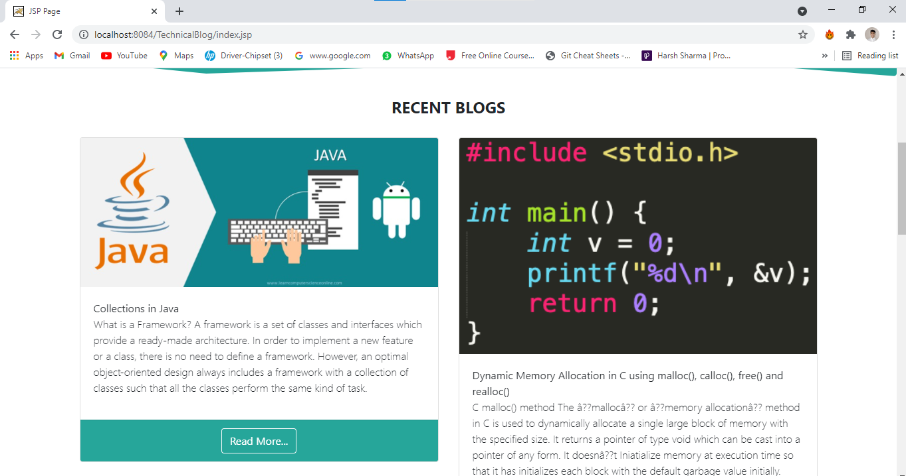
 

 
### SignUp
- First you have to SignUp by providing some information about yourself
  - NAME
  - EMAIL
  - PASSWORD
  - GENDER
 
 This web application is not only about blogs here user can manage profile also.
  

 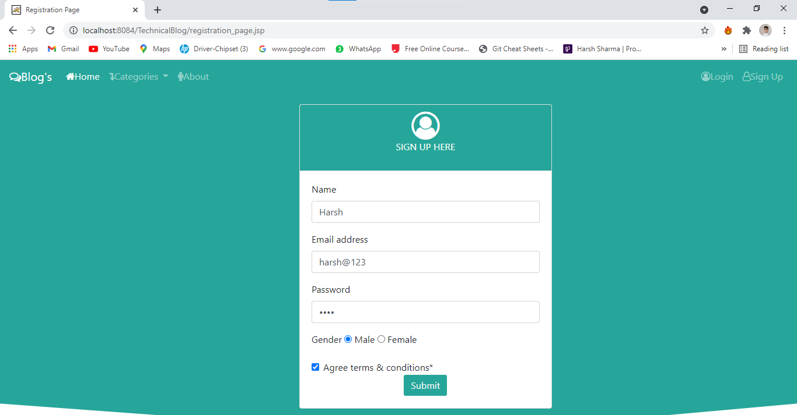

 - Upon First Signup it will redirect you to login page.
 
 

 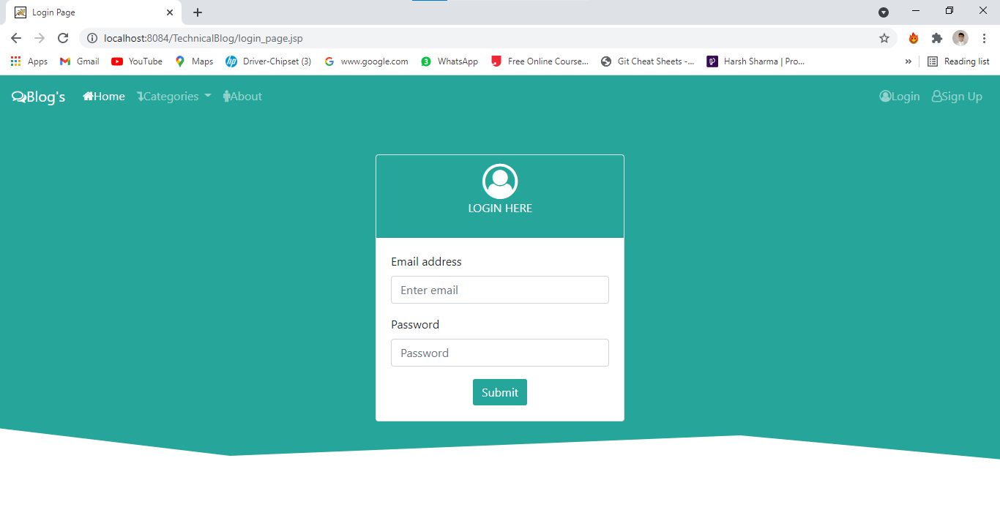

 
 - Upon First Signup if your's credential does'nt match then it will redirect you to login page with message to try again.
 
 

 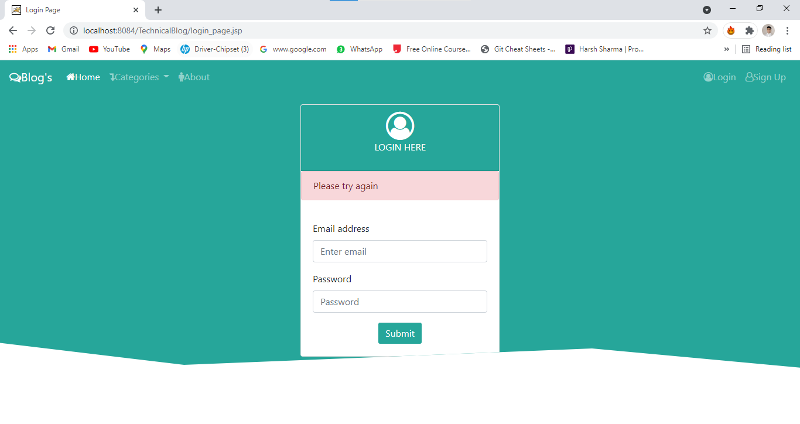

 

### Dashboard

 After you successfully login you can redirect to Profile page 
 

 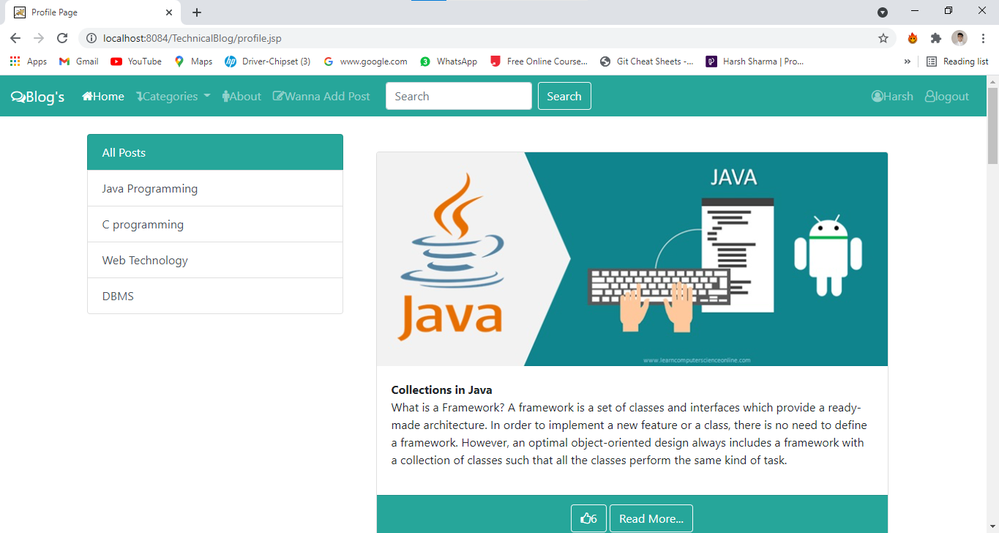

- Dashboard have these options :
 
- `Edit - Profile`
    - With help of edit profile user can change password, profile picture, Name, Email-id.

 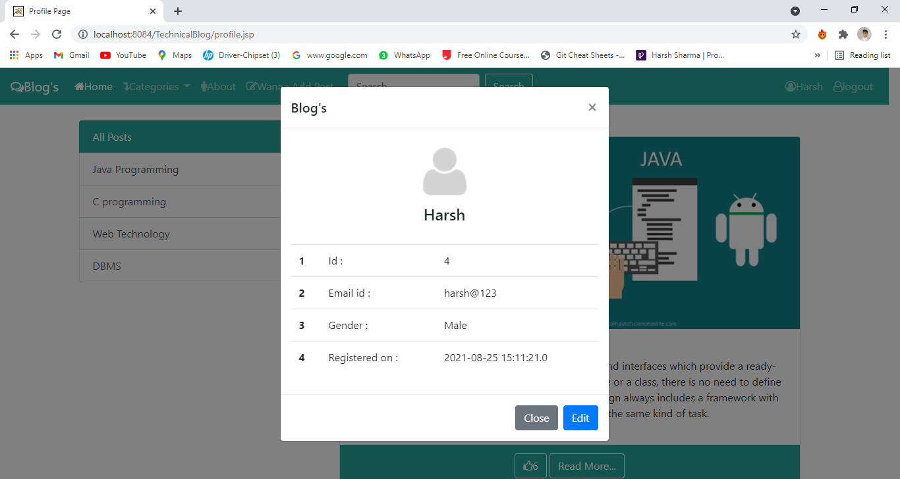

 

 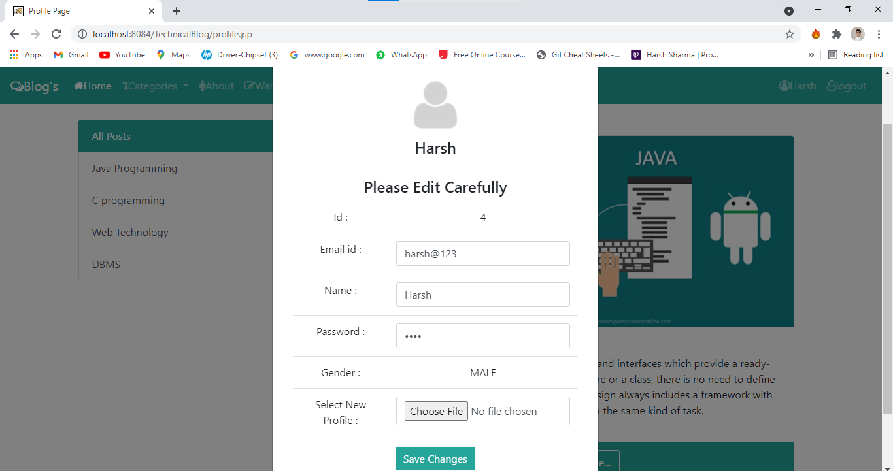

 
 
 - 'Wanna add post`
   - Developers can post their Blogs themselves and these blogs are managed according to userid each user having different id.

 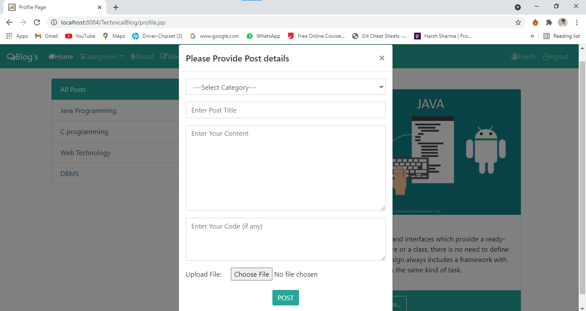

 
 - `Search`
    - With help of search developers can search blogs according to their intrest.
  

 

 
 - `Categories` 
    - Every time when post is added it is saved to a particular category for example java related blog will inside java category. 
 

 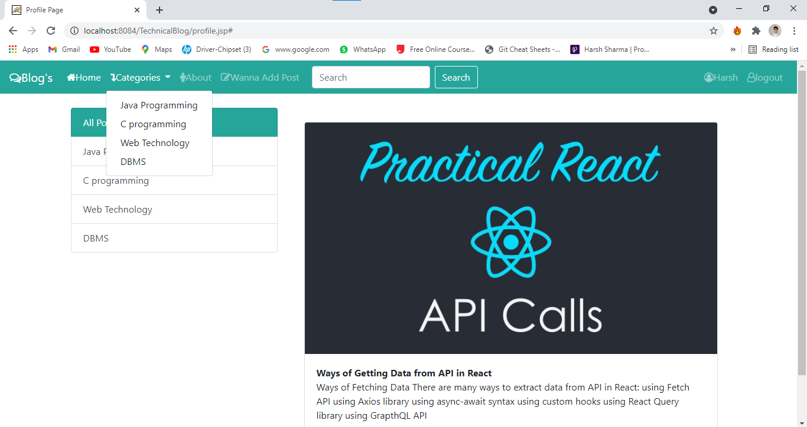

 
  - `Like Blog` 
    - Each blog have it's own likes If developer's having develops intrest or enjoy reading blog they can like the particular blog. 
 

 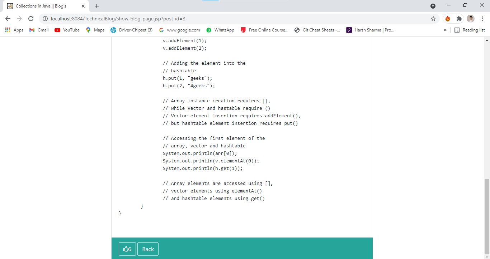

 
 - `View Blog` 
    - For full post developer can click read more option where he can see author name, date and code(if any). 
 

 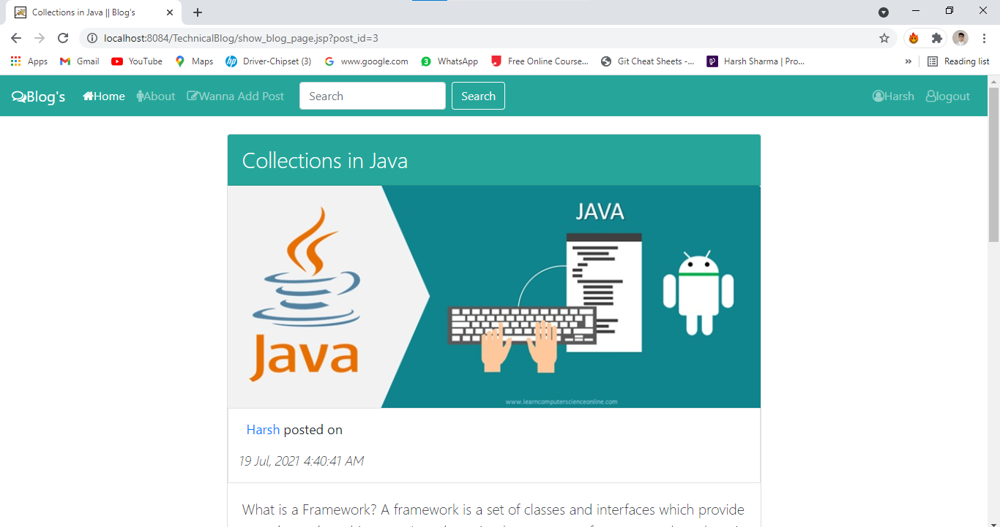

 
  ## Author
  - Harsh Sharma - [harshsharma08](https://github.com/HarshSharma08/)
