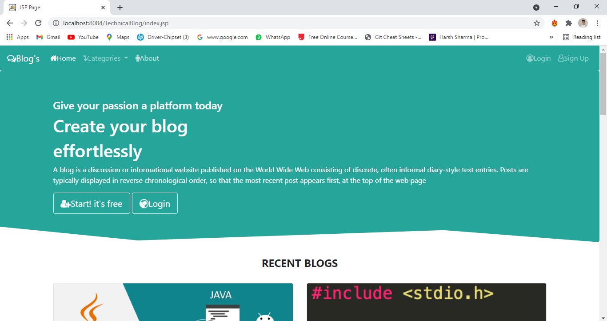

 
         
        

<h1 align="center"> Blogging application </h1>
<h3 align="center"> JAVA Based Blogs Management application <h3>
  

##  Blogging application : About
- It is a JSP/Servlet based project for Blogs. 
- The major idea of sharing knowledge with others with the help of Blogs, as it provides a opportunity to learn from senior developers. 
- It works on the idea that: “User can share past experiences and common error's and can be used as a general blogs.”.
- Does Everything for Knowledge : Sharing Code,Experience and Recent activities related to technical topics .
- Thus this is a modern and hassle-free solution to share knowledge and help fellow developers!
 
 
 ## Insight : 
- It is Web App using JSP/Servlet in MVC pattern.
- Back-End has divided into four sections Dao,entities,helper,servlets.
- Front-end of our Web-App is made with Html,Css,JavaScript,ajax,BootStrap.
- All User-Data is stored on MYSQL Database named technicalblog having four tables are categories,liked,posts,user

 

 
 
## How to Use

### Login
- There are two ways to login
  - Login as `Student`
  - Login as `Institute`
  

 

 - Upon First Signup `Metamask` will ask permission to connect your wallet with App.
 
 

 

- There is an additional security by using `OTP` for Signup .   
- For `Student`  
   -Student need to connect their account with their Institute by giving Institute Address Key .
- For `Institute`  
   -Student will to connect their account with Institute.
   
### Dashboard

 #### Student Dashboard
 
 

 

- Student Dashboard have these options :
 
 - `My Documents`
   - Students can upload their Certificates themselves but these certificates need to be verified by Institute side ,only then                 certificates will appear in my documents section.
 
 - `Give Access`
    - Students can give access to any other institute/organisation to his/her certificates , access is only given for limited time             (24hr)
 
 - `Change Institute` 
    - Students can request change of institute , this request is sent to current institute ,Upon approval students institute is changed. 
   
 #### Institute Dashboard
 
 

 

 
 - Institute Dashboard have these options :
 
 - `Linked Accouts`
   - In this section all student accounts linked to institute are shown.
   - Institute can students certificates from here.
   - Also institute can upload new certificates to students from here.
  
  - `Access Rights`
    - It shows all the student accounts to whom institute has access ,to see their certificates.
  
  - `Pending Approvals`
    - Student requests for certificates approvals appear here .
 
 - `Change Institute Approvals`
   - Student requests for change of institute appear here .
    
  ## Author
  - Harsh Sharma - [harshsharma-hs](https://github.com/HarshSharma08/)
